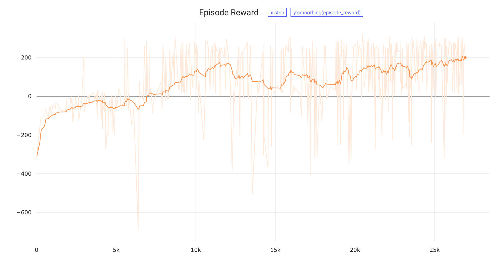

# Training Agents using Upside-Down Reinforcement Learning
This is a Pytorch based implementation of the Upside Down Reinforcement Learning (UDRL) work from Jürgen Schmidhuber's research group. They presented this at an RL workshop at NeurIPS 2019.

> Paper on arXiv - https://arxiv.org/pdf/1912.02877.pdf

> **Summarized Abstract**
>
> Traditional Reinforcement Learning (RL) algorithms either predict rewards with value functions or maximize them using policy search. We study an alternative: Upside-Down Reinforcement Learning (Upside-Down RL or UDRL), that solves RL problems primarily using supervised learning techniques. Here we present the first concrete implementation of UDRL and demonstrate its feasibility on certain episodic learning problems. Experimental results show that its performance can be surprisingly competitive with, and even exceed that of traditional baseline algorithms developed over decades of research.

## Experiments
In this repo, I've tried to solve the *Sparse Lunar Lander* task using the UDRL algorithm from the paper. You can jump right in using the `experiments.ipynb` jupyter notebook. Since *Sparse Lunar Lander* isn't a ready-made environment on OpenAI Gym, I manually mask out the rewards and convert *LunarLander-v2* into a sparse one.

### Dependencies
```
pytorch
numpy
gym[box2d]
tqdm
comet_ml
```

### Sparse Lunar Lander Results


### Blog Post
You can read more about this experiment at - *coming soon*.
